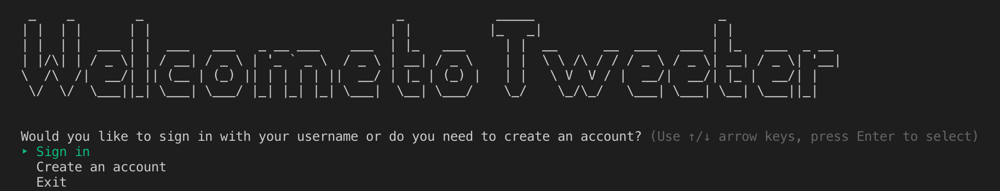

# Tweeter - Module One Project 

We have built a Command Line database application similar to Twitter that allows users to share their thoughts with the world.

## Instructions

### Set Up and Planning
1. Clone Tweeter. 
2. In your terminal, run `bundle install` to install the necessary gems.
3. Run the Tweeter by typing `run bin/run.rb`.
4. You will be invited to sign in with your username, create an account, or exit. You can use the up and down arrows to choose your desired action, then press enter once it is highlighted.
5. Once you are signed in, you have the follwing options: tweets, follows, topics, logout, and exit.
6. If you choose Tweets, you are given more options. You can create a new tweet, see all your tweets, see all tweets for a topic that you will choose, update an older tweet, delete a tweet or exit.
  a. When you choose create a new tweet, you will be asked to enter your message, and what topic it will pertain to.
  b. When you choose see all tweets, they will be listed to the screen.
  c. When you choose see all tweets for a topic, you will then choose a topic, and then you will be shown the tweets for that topic.
  d. When you choose update a tweet, you will choose which tweet to edit, then enter the new message.
  e. When you choose delete a tweet, you will choose which tweet to delete, and it will be destroyed.
7. If you choose Follows, your choices are: following, followers, follow tweeters or exit.
  a. Following will tell you who you are following.
  b. Followers will tell you who follows you. From there you can pick a follower to find out more information about them, such as their tweets or their followers.
  c. Follow tweeter will let you choose from a list of fellow Tweeter users and select one to follow. 
8. If you choose Topics, you can see all topics, see the most popular topic, or see all tweets for a given topic.
9. If you choose Logout, you will be returned to the main menu so that you can log in under another account.  
    

## Final Steps
* Prepare a demo video describing how a user would interact with your working project.
    * The video should:
      * Have an overview of your project.(2 minutes max)
* Prepare a presentation to follow your video.(3 minutes max)      
    * Your presentation should:  
      * Describe something you struggled to build, and show us how you ultimately implemented it in your code.  
      * Discuss 3 things you learned in the process of working on this project.
      * Address, if anything, what you would change or add to what you have today?
      * Present any code you would like to highlight.
* OPTIONAL, BUT RECOMMENDED: Write a blog post about the project and process.

